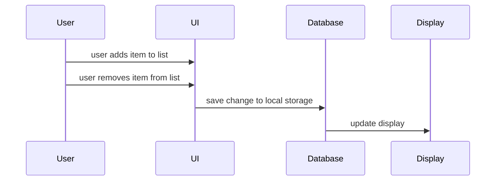

# Planner/Wishlist

This feature allows the user to add their expenses into a planner and if they want to, they can also put items they want in a wishlist. They will be able to add an item to either list and can optionally provide a brief description of it. This lets users keep track of current and future expenses, write down notes, and keep track of items they would like to buy. 

## Sequence Diagram

