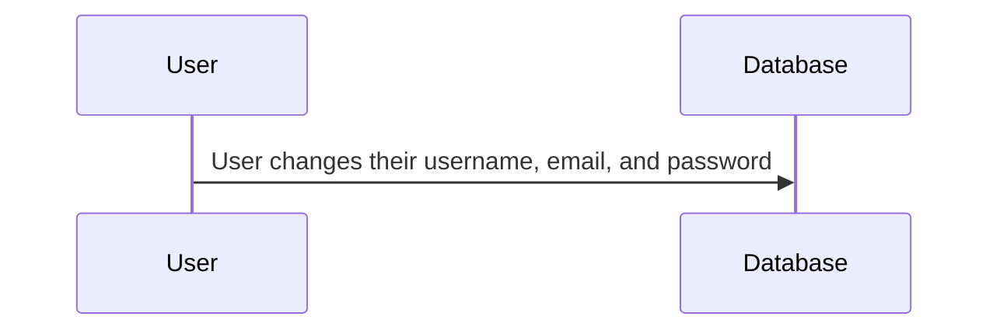

# Settings

This feature is where users adjust the settings of the application. Currently it just allows the updating of the user's username, account, and password, storing the information to be used when the backend is further developed.  

## Sequence Diagram

