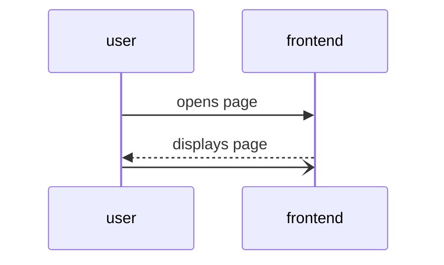

# Tips Feature
**Description:** 
The tips feature provides budgeting advice by highlighting two key spending areas: the user's biggest purchase and largest expense category. It generates three weekly tips—either automatically or user-initiated—sourced from general saving strategies or personalized user tips like "Dunkin' only once a week," which appear randomly in weekly suggestions. A "tip jar" allows users to submit personal tips, and a sidebar highlights three finance influencers with links to their social media for additional advice.

## Sequence Diagram

