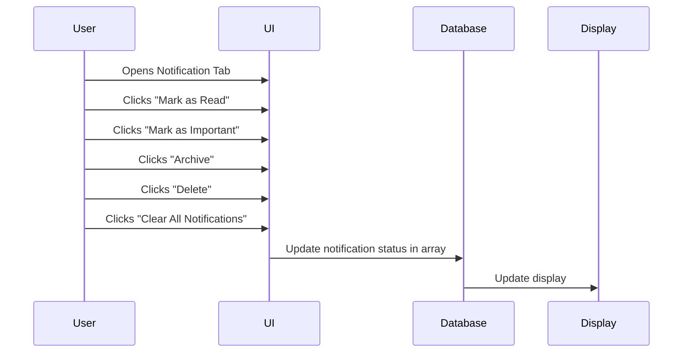

# Notifications
The notification system in the web application is designed to help users manage their alerts and messages efficiently. Once users open the notification tab, they can see all their notifications and have several options for handling them. They can mark notifications as read, highlight them as important, archive for later use, or delete them to keep things tidy. There’s also an option to clear all notifications at once. Each action updates the notification data in real-time, ensuring that the display always shows the most current information, making the whole process smooth and intuitive.

## Sequence Diagram

