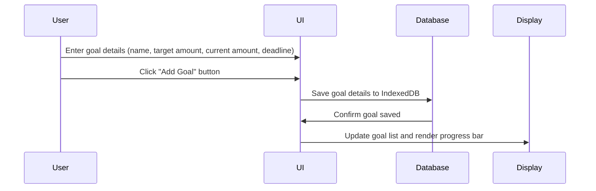

# Savings Goals Tracker

This feature allows the user to create and manage savings goals by entering a goal name, target amount, current savings amount, and a deadline. Once a goal is added, it is displayed in the UI with a progress bar showing how much of the target has been achieved. Users can also edit or delete existing goals. The tracker stores this data in IndexedDB, ensuring goals persist across sessions.

## Sequence Diagram

