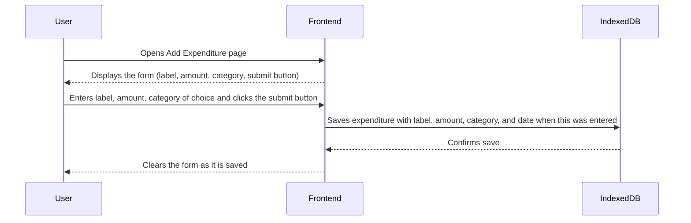

# Categorize Expenses Features

## Add Expenditure
**Description:**  
The Add-Expenditure feature allows users to store their expenses in the logs by entering a label of choice, amount they spent, and the category they would like to put that expense under. All expenditures are saved to an indexed database. The feature ensures users can store their spending in real time and keep seamless track of them.

### Sequence Diagram
